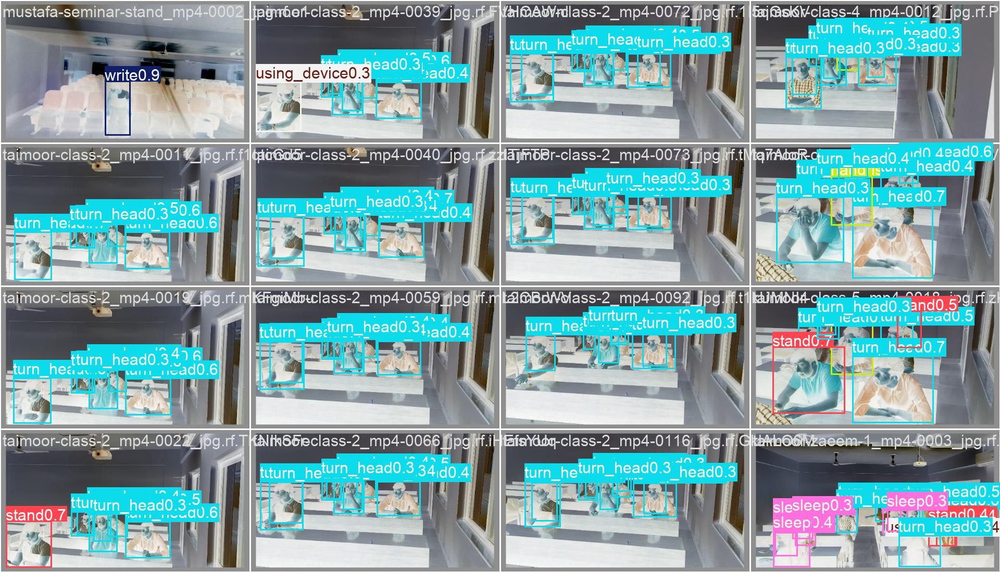
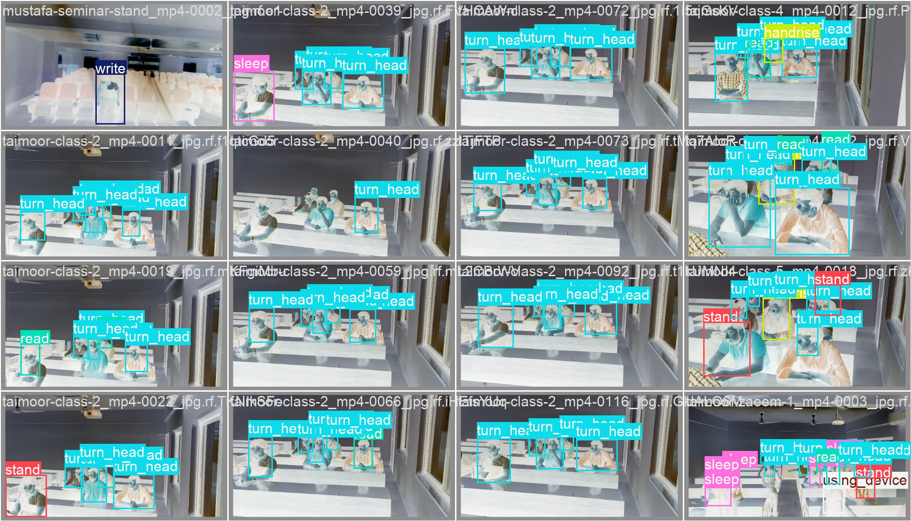
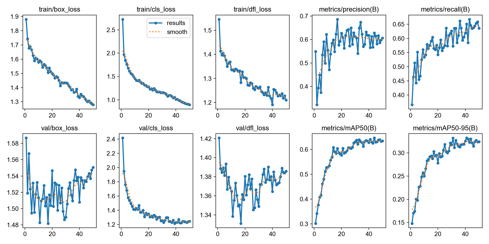
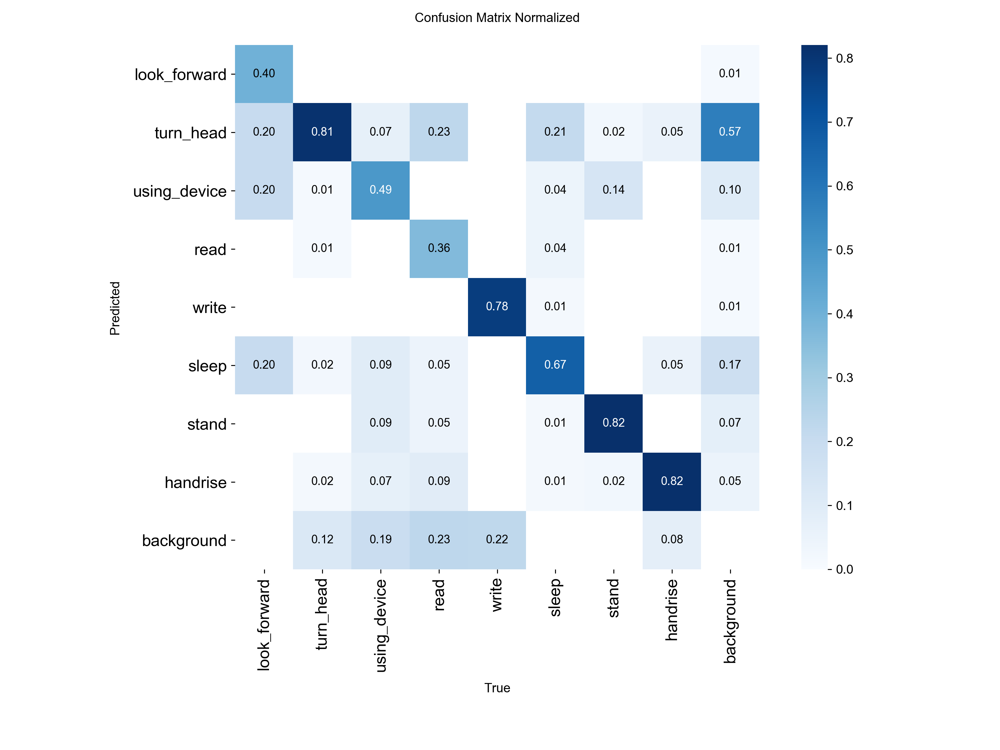
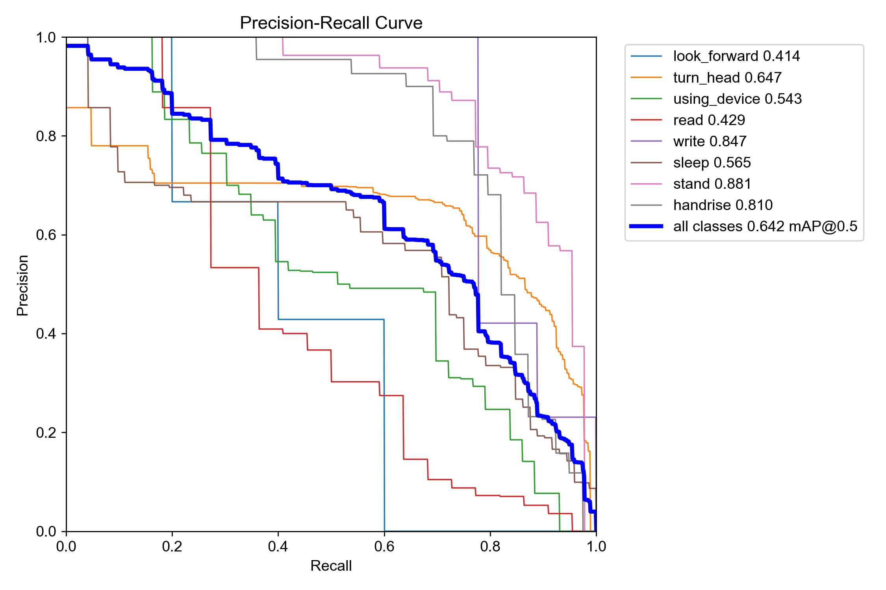

# Yolo-Classroom-Action-Tracker

**Real-time classroom student behavior & engagement monitoring, powered by YOLOv8.**

Detects what students are actually doing in class — listening, writing, reading, raising a hand, using a phone, or sleeping — straight from video or images, so teachers get an objective, data-driven read on classroom engagement.

<p align="left">
  
  
  
  
  
  
</p>

---

## 📋 Table of Contents

- [Overview](#-overview)
- [Detected Behaviors](#-detected-behaviors)
- [Demo Results](#-demo-results)
- [Model Performance](#-model-performance)
- [Project Structure](#-project-structure)
- [Dataset](#-dataset)
- [Getting Started](#-getting-started)
- [Usage](#-usage)
- [Training Details](#-training-details)
- [Roadmap](#-roadmap)
- [Acknowledgments](#-acknowledgments)

---

## 🔍 Overview

`Yolo-Classroom-Action-Tracker` is a computer vision project that fine-tunes **YOLOv8** on a custom-annotated classroom dataset to detect **student engagement behaviors** in real time. Point it at a classroom photo, video, or live camera feed, and it draws bounding boxes around each student labeled with what they're doing — giving educators and researchers a quick, quantifiable view of attention and participation levels in the room.

The pipeline covers the full workflow end to end:

1. **Data ingestion** — pulls a classroom engagement dataset from Kaggle via `kagglehub`
2. **Dataset prep** — reorganizes and splits images/labels into YOLO-format train/validation sets
3. **Training** — fine-tunes a pretrained `yolov8s.pt` checkpoint on the 8 custom classes
4. **Inference** — runs the trained model on new images to visualize predictions

---

## 🎯 Detected Behaviors

The model is trained to recognize **8 classroom action classes**:

| # | Class | Behavior |
|---|-------|----------|
| 0 | `look_forward` | 👀 Facing forward / paying attention |
| 1 | `turn_head` | 🔄 Head turned away from the front |
| 2 | `using_device` | 📱 Using a phone or other device |
| 3 | `read` | 📖 Reading |
| 4 | `write` | ✍️ Writing |
| 5 | `sleep` | 😴 Sleeping / head down |
| 6 | `stand` | 🧍 Standing |
| 7 | `handrise` | ✋ Raising a hand |

---

## 🖼️ Demo Results

Sample validation predictions and training diagnostics generated by the model:

<table>
<tr>
<td align="center"><b>Predictions on validation batch</b><br></td>
<td align="center"><b>Ground truth labels</b><br></td>
</tr>
</table>

<details>
<summary><b>📊 Click to see training curves & confusion matrix</b></summary>
<br>

**Training / validation loss & metric curves**


**Confusion matrix (normalized)**


**Precision-Recall curve**


</details>

---

## 📈 Model Performance

Trained for **50 epochs** on `yolov8s.pt`. Best checkpoint (epoch 44) results:

| Metric | Score |
|---|---|
| **Precision** | 0.628 |
| **Recall** | 0.646 |
| **mAP@0.5** | 0.647 |
| **mAP@0.5:0.95** | 0.331 |

<details>
<summary>Final epoch (50) metrics</summary>

| Metric | Score |
|---|---|
| Precision | 0.606 |
| Recall | 0.636 |
| mAP@0.5 | 0.635 |
| mAP@0.5:0.95 | 0.324 |

</details>

> 💡 Best-performing classes tend to be visually distinct ones like `handrise` and `sleep`; classes like `read` vs. `write` are harder to separate due to similar posture — see the confusion matrix above.

---

## 🗂️ Project Structure

```
Yolo-Classroom-Action-Tracker/
├── student_main_yolo.ipynb        # End-to-end notebook: data prep → train → infer
├── data.yaml                      # YOLO dataset config (8 classes)
├── yolov8s.pt                     # Pretrained YOLOv8s base weights
├── custom_data/
│   ├── images/                    # Raw source images
│   └── labels/                    # YOLO-format label files
├── data/
│   ├── train/                     # Train split (images + labels)
│   └── validation/                # Validation split (images + labels)
└── runs/
    └── detect/
        └── student_engagement/
            ├── weights/
            │   ├── best.pt        # Best checkpoint
            │   └── last.pt        # Final epoch checkpoint
            ├── results.png        # Training curves
            ├── confusion_matrix*.png
            └── val_batch*.jpg     # Prediction visualizations
```

---

## 📦 Dataset

- **Source:** [Classroom Student Engagement Dataset](https://www.kaggle.com/datasets/mustafaxgm/classroom-student-engagement-dataset) (Kaggle, via `kagglehub`)
- **Total images:** ~481, split roughly 90/10 into train (432) and validation (49)
- **Format:** YOLO (`.txt` bounding box labels, one file per image)
- **Classes:** 8 (see [Detected Behaviors](#-detected-behaviors))

---

## 🚀 Getting Started

### 1. Clone the repo

```bash
git clone https://github.com/AkhileshDasari/Yolo-Classroom-Action-Tracker.git
cd Yolo-Classroom-Action-Tracker
```

### 2. Install dependencies

```bash
pip install ultralytics kagglehub
```

### 3. Run the notebook

Open `student_main_yolo.ipynb` and run cells in order to:
- Download the dataset
- Build the train/validation split
- Train the model
- Run inference on validation images

---

## 🛠️ Usage

**Run inference with the trained model:**

```python
from ultralytics import YOLO

# Load the trained checkpoint
model = YOLO("runs/detect/student_engagement/weights/best.pt")

# Predict on an image, folder, or video
results = model.predict(source="path/to/image_or_video", save=True, conf=0.5)
```

**Run on a live webcam feed:**

```python
model.predict(source=0, show=True, conf=0.5)
```

**Train from scratch (or fine-tune further):**

```python
from ultralytics import YOLO

model = YOLO("yolov8s.pt")
model.train(
    data="data.yaml",
    epochs=50,
    imgsz=640,
    batch=8,
    name="student_engagement",
    patience=20
)
```

---

## ⚙️ Training Details

| Setting | Value |
|---|---|
| Base model | `yolov8s.pt` |
| Image size | 640×640 |
| Epochs | 50 |
| Batch size | 8 |
| Early stopping patience | 20 |
| Optimizer | Auto (Ultralytics default) |
| Augmentations | Mosaic, HSV jitter, horizontal flip, translate/scale |

---

## 🗺️ Roadmap

- [ ] Expand dataset with more diverse classroom angles/lighting
- [ ] Add multi-student tracking (persistent IDs across frames) for engagement-over-time analytics
- [ ] Build a live dashboard summarizing class-wide engagement trends
- [ ] Experiment with larger backbones (YOLOv8m/l) for accuracy gains
- [ ] Package as a simple CLI / Streamlit app for non-technical users

---

## 🙏 Acknowledgments

- [Ultralytics YOLOv8](https://github.com/ultralytics/ultralytics) for the detection framework

---

<p align="center"><i>Built to help make classroom engagement measurable, not just anecdotal.</i></p>
